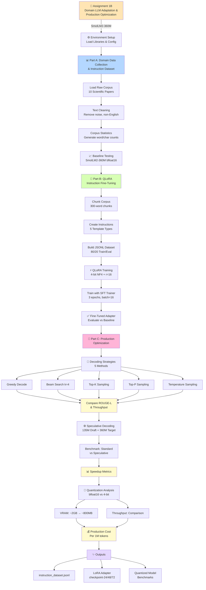

# Assignment 1B - Overall Flow Diagram

## Domain LLM Adaptation & Production Optimization

## Flow Overview

### Part A: Domain Data Collection & Instruction Dataset (2 marks)
- **Load Raw Corpus**: Collect 10 scientific research papers
- **Text Cleaning**: Remove noise, non-ASCII, and non-English content
- **Corpus Statistics**: Generate word/character/sentence counts
- **Baseline Testing**: Test base model (SmolLM2-360M bfloat16) on domain prompts

### Part B: QLoRA Instruction Fine-Tuning (5 marks)
- **Chunk Corpus**: Split documents into 300-word overlapping chunks
- **Create Instructions**: Generate 5 types of instruction templates
- **Build JSONL Dataset**: Create 80/20 train/eval split
- **QLoRA Training**: Fine-tune using 4-bit NF4 quantization with LoRA (r=16, alpha=32)
- **Train Adapter**: 3 epochs with batch size 16
- **Evaluate**: Compare fine-tuned vs baseline outputs using ROUGE metrics

### Part C: Production Optimization & Economics (8 marks)

#### C1: Decoding Strategies (3 marks)
Compare 5 decoding methods:
- Greedy decoding
- Beam search (k=4)
- Top-K sampling (k=50)
- Top-P sampling (p=0.9)
- Temperature sampling (0.7)

Evaluate throughput and ROUGE-L quality

#### C2: Speculative Decoding (2 marks)
- Draft model: SmolLM2-135M-Instruct
- Target model: SmolLM2-360M-Instruct
- Benchmark standard vs speculative speedup

#### C3: Quantization & Cost Analysis (3 marks)
- VRAM comparison: bfloat16 vs 4-bit NF4
- Throughput analysis
- Production cost per 1M tokens across multiple GPU instances

## Key Outputs
- `instruction_dataset.jsonl`: Training dataset with 80/20 split
- `qlora_output/`: Final adapter weights and checkpoints
- Benchmarks and cost analysis reports
