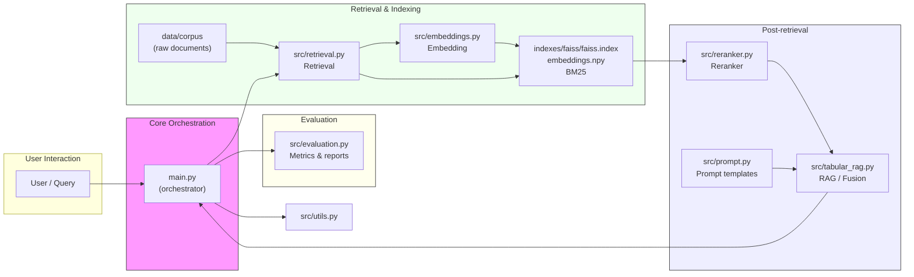

# LLM RAG Assignment — Project Overview

## Project Summary

This repository implements a Retrieval-Augmented Generation (RAG) pipeline for document-level question answering and evaluation. It contains data, indexing, embedding, retrieval, reranking, and evaluation components used in Assignment 2B.

## Architecture


The diagram below shows the high-level architecture and main code components.




## Purpose

This project demonstrates a Retrieval-Augmented Generation (RAG) pipeline for document-level QA. It is intended to:

- Show how retrieval (BM25 / ANN) and embeddings work together to provide context to a generator.
- Illustrate indexing and reranking strategies for improving retrieval quality.
- Provide an evaluation pipeline to measure retrieval and answer quality.

## Lessons Learned

- Chunking documents appropriately is critical to balance context relevance and index size.
- Choice of embedding model strongly affects semantic recall; smaller models are faster but less accurate.
- Reranking retrieved candidates before generation reduces hallucination risk and improves final answers.
- FAISS provides fast ANN lookups at scale; BM25 remains useful for lexical matches and quick baselines.

## Exposure & Execution Steps

Follow these steps to explore and run the project end-to-end:

1. Create a virtual environment and install dependencies (see Running the project).
2. Inspect the raw documents in `data/corpus` to understand content and domain.
3. Run `src/chunking.py` (if present) to reproduce document chunking used for embeddings.
4. Generate or regenerate embeddings via `src/embeddings.py` and save them to `indexes/embeddings.npy`.
5. Build or rebuild indexes (FAISS and/or BM25) from the embeddings and chunk metadata.
6. Run retrieval via `src/retrieval.py` to get candidate passages for a sample query.
7. Run reranking using `src/reranker.py` and observe differences in top candidates.
8. Execute `src/tabular_rag.py` (or `main.py`) to fuse retrieved context and produce responses.
9. Run evaluation with `src/evaluation.py` and review `outputs/eval_results.json`.
10. Open `notebooks/assignment_2b.ipynb` for interactive exploration and visualizations.

Suggested experiments:

- Vary chunk size and measure impact on retrieval precision/recall.
- Swap embedding models and compare nearest-neighbour results.
- Compare FAISS vs BM25 retrieval performance on a held-out dev set.
- Tune reranker scoring and observe effects on final generated answers.

## Running the project (quick)

1. Create a virtual environment and install deps:

```bash
python3 -m venv .venv
source .venv/bin/activate
pip install -r requirements.txt
```

2. Run the main pipeline (example):

```bash
python main.py
```

3. Run tests / evaluation:

```bash
python test_pipeline.py
```

## Files to review

- [main.py](main.py)
- [src/retrieval.py](src/retrieval.py)
- [src/embeddings.py](src/embeddings.py)
- [src/reranker.py](src/reranker.py)
- [src/tabular_rag.py](src/tabular_rag.py)
- [src/evaluation.py](src/evaluation.py)

## Notes

- The repository contains both index artifacts and code to reproduce them. Follow the Exposure & Execution Steps to rebuild indexes and rerun evaluations.
