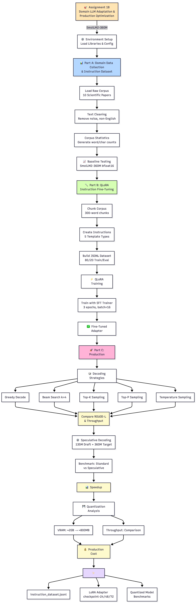

# Group138 — LLM Assignment 2B (RAG)

This repository contains the trimmed project for "Group138 LLM Assignment 2B" (RAG pipeline). Large/generated files (indexes, embeddings, outputs, notebooks, and raw data) were excluded to keep the pushed branch small.

## What's included
- Project source: `src/`
- Core scripts: `main.py`, `test_pipeline.py`, `find_blocker.py`
- Docs and project notes: `ACTION_PLAN.md`, `EXECUTION_EVIDENCE.md`, `Group138_LLM_Assignment2B_Implementation_Guide.md`

## Setup
1. Create a virtual environment and activate it:

```bash
python -m venv .venv
source .venv/bin/activate
```

2. Install dependencies:

```bash
pip install -r requirements.txt
```

## Usage
- Run the main pipeline (example):

```bash
python main.py
```

- Run tests/evaluation:

```bash
python test_pipeline.py
```

## Notes
- This branch: `assignment-2b` (pushed to https://github.com/pavan-kumar-arepu/RAG/tree/assignment-2b)
- Large files and generated artifacts are intentionally excluded. If you need to rebuild indexes or embeddings, run the corresponding scripts in `src/`.

## Flow Diagram

Flow diagram for the RAG pipeline (generated on 2026-08-03):


